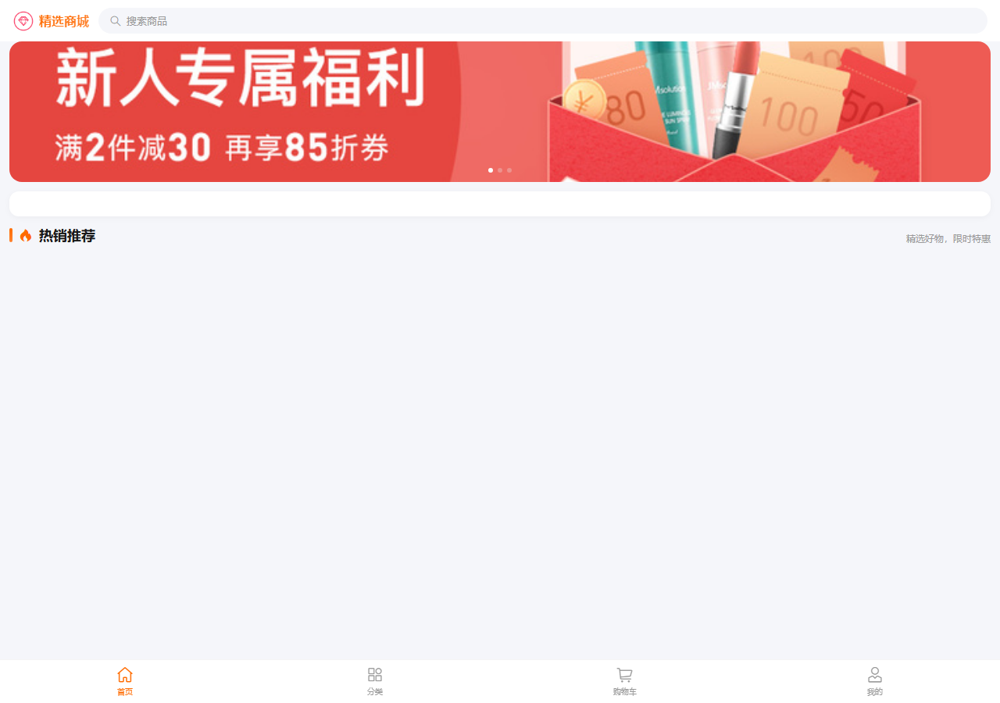
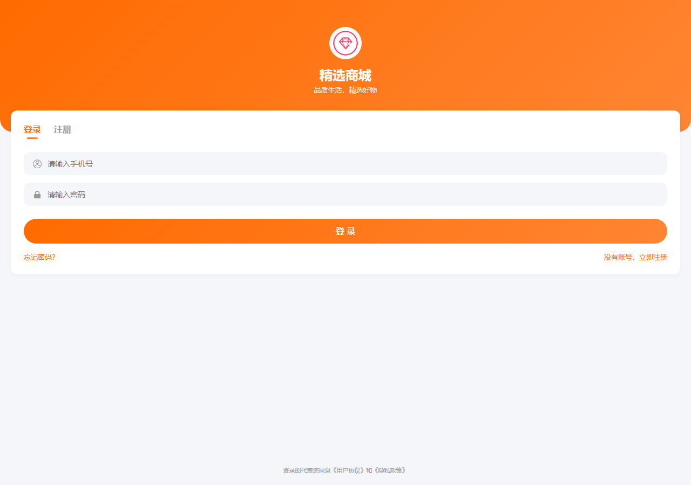
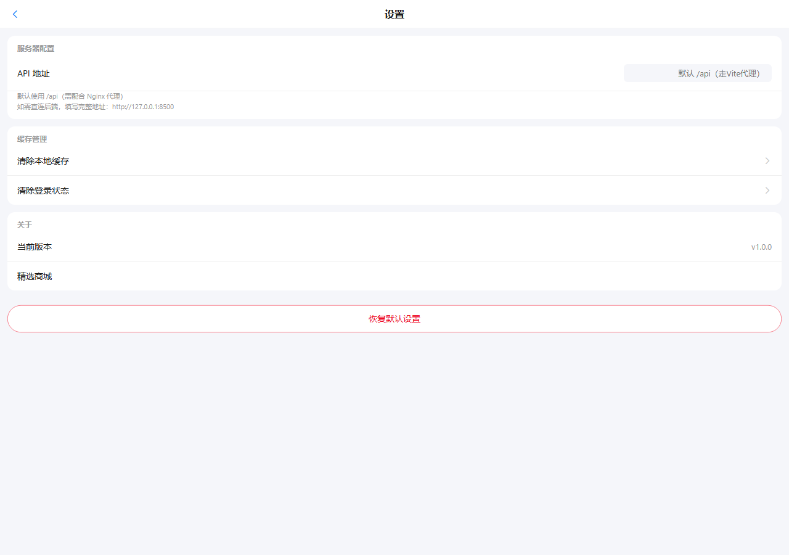
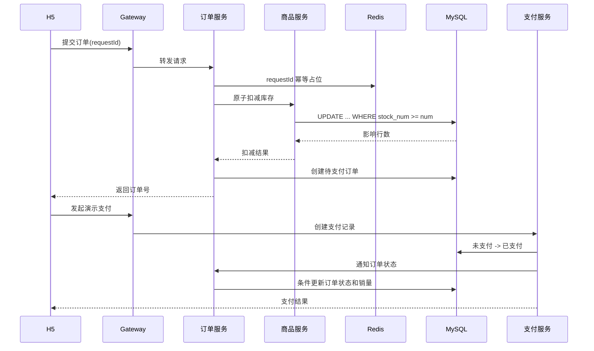

# 精选商城

[](https://github.com/weakll/selection-mall/actions/workflows/ci.yml)

精选商城（Selection Mall）是一个基于 `Spring Cloud Alibaba` 和 `Vue 3` 的前后端分离微服务商城项目，覆盖商品浏览、购物车、下单、库存控制、优惠券和可演示支付链路。

## 演示截图

### 商城首页



### 商品详情素材


商品详情页使用本地演示图片，完整图片资源和来源见 [演示素材说明](docs/demo-assets.md)。

### 用户登录



### 系统设置



## 项目状态

v1 核心功能已完成，当前持续完善部署验证、演示材料和生产环境增强。后端模块和 H5 前端均已通过本地构建验证。

## v1 目标

- 网关统一路由与登录校验
- 用户、商品、购物车、订单和支付服务拆分
- Nacos 服务注册发现
- OpenFeign 服务调用
- Redis 商品缓存与缓存一致性
- 库存原子扣减与防超卖
- 订单提交幂等与待付款订单取消
- 支付记录幂等、订单状态流转与库存恢复
- Vue 3 H5 商城
- Docker Compose 本地基础设施与生产化应用编排
- GitHub Actions 构建验证

## 服务职责与请求链路

| 服务 | 职责 |
|:---|:---|
| Gateway | 统一入口、路由转发和登录校验 |
| service-user | 用户注册、登录和用户信息 |
| service-product | 商品、分类、品牌和库存 |
| service-cart | 购物车管理 |
| service-order | 订单创建、幂等控制、超时关闭和库存回补 |
| service-pay | 支付记录、支付状态流转和重复回调处理 |
| MySQL | 业务数据持久化 |
| Redis | 商品缓存和订单提交幂等控制 |
| Nacos | 服务注册与配置管理 |

典型请求链路：H5 -> Gateway -> 业务服务 -> MySQL/Redis；服务间调用通过 OpenFeign 完成，支付完成后由支付服务按状态条件更新订单。

## 下单到支付时序



## 技术栈

| 层级 | 技术 |
|:---|:---|
| 后端 | Java 17、Spring Boot、Spring Cloud Alibaba、Nacos、OpenFeign |
| 数据 | MySQL、MyBatis、Redis |
| 网关 | Spring Cloud Gateway |
| 前端 | Vue 3、Vite、Vant、Pinia、Vue Router、Axios |
| 工程化 | Maven、Docker Compose、GitHub Actions |

## 仓库结构

```text
selection-mall/
├─ backend/          # Java 微服务后端
├─ mall-h5/          # Vue 3 H5 商城
├─ deploy/           # 本地部署与基础设施配置
├─ docs/             # 架构、开发和路线图
└─ .github/          # CI 与仓库协作配置
```

## 文档

- [架构设计](docs/architecture.md)
- [商品缓存一致性](docs/cache-consistency.md)
- [交易一致性](docs/transaction-consistency.md)
- [开发说明](docs/development.md)
- [开发路线图](docs/roadmap.md)
- [后端迁移说明](backend/README.md)
- [H5 迁移说明](mall-h5/README.md)
- [本地部署说明](deploy/README.md)

## 快速启动

环境要求：JDK 17、Maven 3.9+、Node.js 20+、pnpm 9+ 和 Docker Desktop。

```powershell
Copy-Item .env.example .env
docker compose --env-file .env -f deploy/docker-compose.yml up -d

cd backend
mvn -B package

cd ..\mall-h5
pnpm install --frozen-lockfile
pnpm dev
```

基础设施端口、数据库初始化和生产化编排请参阅 [开发说明](docs/development.md) 与 [部署说明](deploy/README.md)。本仓库不提供固定线上测试账号；本地账号请通过注册页面创建，支付为本地演示流程。

## 当前验证

- 后端：Maven 编译、打包和单元测试
- H5：pnpm 依赖锁定安装和生产构建
- CI：推送或 Pull Request 到 `main` 时自动执行上述两类验证
- 库存回补失败：持久化补偿记录并由定时任务指数退避重试

## Roadmap

v1 先完成微服务商城、缓存一致性、库存并发控制和支付幂等。v2 计划增加 AI 智能客服能力，通过独立服务接入，不提前耦合到 v1 主链路。

## Acknowledgements

业务流程和工程实践参考了公开电商系统的通用设计，仓库中的代码、配置和文档均按本项目结构独立整理。
