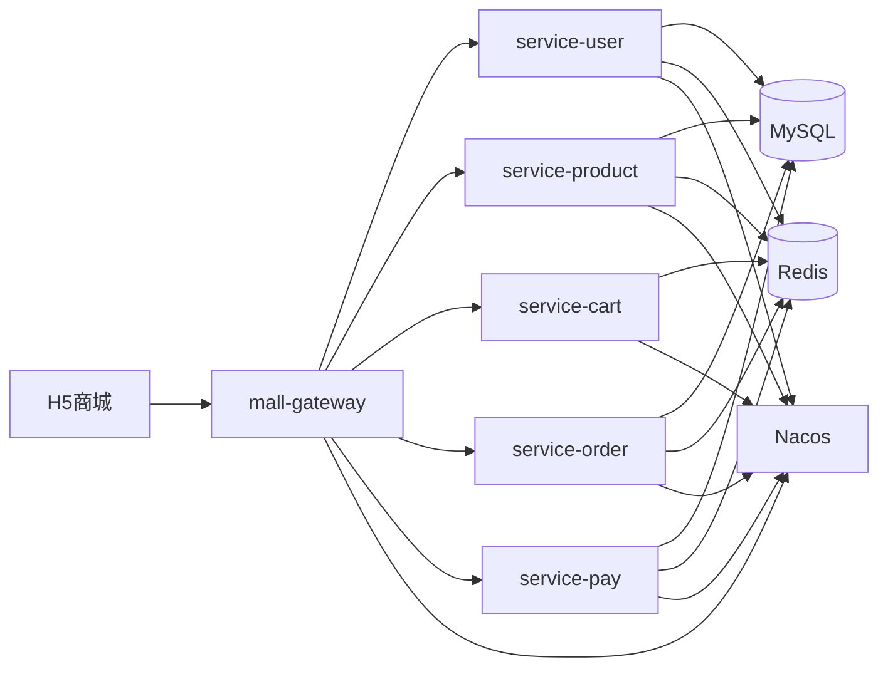

# 架构设计

## v1 目标架构

## 服务职责

| 服务 | 职责 |
|:---|:---|
| `mall-gateway` | 请求路由、跨域、登录态校验 |
| `service-user` | 登录、用户信息、收货地址 |
| `service-product` | 分类、品牌、商品、SKU 与缓存 |
| `service-cart` | 购物车保存与结算数据 |
| `service-order` | 订单创建、订单状态和超时关闭 |
| `service-pay` | 支付记录与支付回调 |

## 关键链路

### 商品查询

1. 请求进入网关。
2. 商品服务查询 Redis。
3. 缓存未命中时查询 MySQL。
4. 回填缓存并返回。
5. 商品变更时删除相关缓存。

### 下单与支付

1. 用户提交订单。
2. 订单服务校验请求幂等键。
3. 商品服务原子扣减库存。
4. 订单服务保存订单和明细。
5. 支付服务生成支付记录。
6. 支付回调通过状态条件更新保证幂等。
7. 超时未支付订单关闭并回补库存。

## 扩展边界

AI 智能客服作为 v2 独立能力接入。v1 不将模型调用、知识库和对话状态放入商城核心交易链路，避免增加交易系统复杂度和故障面。
